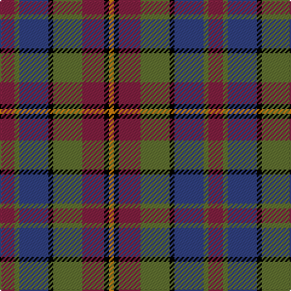

The parent of this is [Orkney](/tartans/dr/12/g4/b24/k4/g24/dr18/k4/o/4/)

This was sourced from weddslist.  It is a [8 stripes tartan](/stripes/stripes8/).

Original link http://www.weddslist.com/cgi-bin/tartans/pg.pl?source=sts

## Thread count
DR/12 G4 B24 K4 G24 DR18 K4 O/4

## Palette
Each colour and its ΔE from the base-6 reference it is a variant of.

| Colour | Shade | Base | ΔE (OKLab) |
|---|---|---|---|
| B |  `#304080` | B  | 0.01 |
| DR |  `#802040` | R  | 0.16 |
| G |  `#607030` | G  | 0.11 |
| K |  `#000000` | K  | 0.00 |
| O |  `#D08010` | Y  | 0.17 |

# Sample pattern

ID: /variants/dr/12/g4/b24/k4/g24/dr18/k4/o/4-b304080-dr802040-g607030-k000000-od08010/
