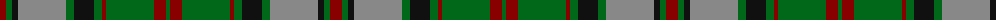

The parent of this is [MacNeish Htg](/tartans/dr/12/g6/k6/n48/g8/k20/g8/dr4/g48/dr12/g/4/)

This was sourced from tartans-authority.  It is a [11 stripes tartan](/stripes/stripes11/).

Original link http://www.tartansauthority.com/tartan-ferret/display/3510/

## Thread count
DR/12 G6 K6 N48 G8 K20 G8 DR4 G48 DR12 G/4

## Palette
Each colour and its ΔE from the base-6 reference it is a variant of.

| Colour | Shade | Base | ΔE (OKLab) |
|---|---|---|---|
| DR |  `#880000` | R  | 0.14 |
| G |  `#006818` | G  | 0.02 |
| K |  `#101010` | K  | 0.17 |
| N |  `#888888` | R  | 0.24 |

ID: /variants/dr/12/g6/k6/n48/g8/k20/g8/dr4/g48/dr12/g/4-dr880000-g006818-k101010-n888888/
