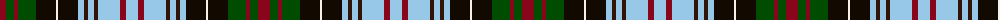

The parent of this is [Redgate in Connecticut (Ulster-Scots)](/tartans/dr/12/g8/dr4/g18/k20/w2/k20/lb6/ka4/lb6/ka4/lb22/dr6/lb/12/)

This was sourced from register-of-tartans.  It is a [14 stripes tartan](/stripes/stripes14/).

Original link https://www.tartanregister.gov.uk/tartanDetails.aspx?ref=10810

## Thread count
DR/12 G8 DR4 G18 K20 W2 K20 LB6 Ka4 LB6 Ka4 LB22 DR6 LB/12

## Palette
Each colour and its ΔE from the base-6 reference it is a variant of.

| Colour | Shade | Base | ΔE (OKLab) |
|---|---|---|---|
| DR |  `#89051B` | R  | 0.14 |
| G |  `#004C00` | G  | 0.08 |
| K |  `#120A01` | K  | 0.15 |
| Ka |  `#321308` | B  | 0.23 |
| LB |  `#98C8E8` | W  | 0.17 |
| W |  `#F7F1E8` | W  | 0.01 |

ID: /variants/dr/12/g8/dr4/g18/k20/w2/k20/lb6/ka4/lb6/ka4/lb22/dr6/lb/12-dr89051b-g004c00-k120a01-ka321308-lb98c8e8-wf7f1e8/
