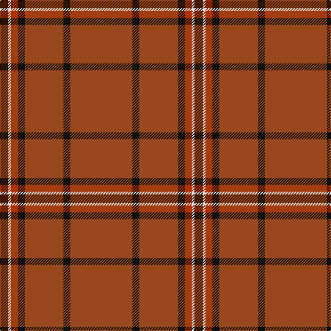

The parent of this is [Leiato of American Samoa (Personal)](/tartans/dr/12/ln4/r10/k10/t56/k10/t/90/)

This was sourced from register-of-tartans.  It is a [7 stripes tartan](/stripes/stripes7/).

Original link https://www.tartanregister.gov.uk/tartanDetails.aspx?ref=2085

## Thread count
DR/12 LN4 R10 K10 T56 K10 T/90

## Palette
Each colour and its ΔE from the base-6 reference it is a variant of.

| Colour | Shade | Base | ΔE (OKLab) |
|---|---|---|---|
| DR |  `#441800` | B  | 0.22 |
| K |  `#101010` | K  | 0.17 |
| LN |  `#E0E0E0` | W  | 0.06 |
| R |  `#B03000` | R  | 0.05 |
| T |  `#98481C` | R  | 0.11 |

# Sample pattern

ID: /variants/dr/12/ln4/r10/k10/t56/k10/t/90-dr441800-k101010-lne0e0e0-rb03000-t98481c/
