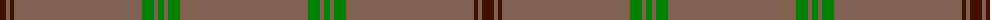

The parent of this is [Connacht](/tartans/dr/12/lt4/dr4/lt128/g12/lt4/g6/lt4/g12/lt/128/)

This was sourced from weddslist.  It is a [10 stripes tartan](/stripes/stripes10/).

Original link http://www.weddslist.com/cgi-bin/tartans/pg.pl?source=sts

## Thread count
DR/12 LT4 DR4 LT128 G12 LT4 G6 LT4 G12 LT/128

## Palette
Each colour and its ΔE from the base-6 reference it is a variant of.

| Colour | Shade | Base | ΔE (OKLab) |
|---|---|---|---|
| DR |  `#401000` | B  | 0.23 |
| G |  `#008000` | G  | 0.09 |
| LT |  `#806050` | R  | 0.17 |

ID: /variants/dr/12/lt4/dr4/lt128/g12/lt4/g6/lt4/g12/lt/128-dr401000-g008000-lt806050/
