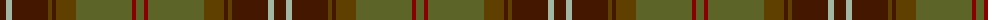

The parent of this is [Scottish Crofting Foundation (Corp)](/tartans/dr/12/n6/dr36/t4/dr4/t20/g56/dra4/g/8/)

This was sourced from tartans-authority.  It is a [9 stripes tartan](/stripes/stripes9/).

Original link http://www.tartansauthority.com/tartan-ferret/display/7239/

## Thread count
DR/12 N6 DR36 T4 DR4 T20 G56 DRa4 G/8

## Palette
Each colour and its ΔE from the base-6 reference it is a variant of.

| Colour | Shade | Base | ΔE (OKLab) |
|---|---|---|---|
| DR |  `#441800` | B  | 0.22 |
| DRa |  `#880000` | R  | 0.14 |
| G |  `#5C6428` | G  | 0.09 |
| N |  `#A0B8A4` | Y  | 0.16 |
| T |  `#604000` | G  | 0.14 |

ID: /variants/dr/12/n6/dr36/t4/dr4/t20/g56/dra4/g/8-dr441800-dra880000-g5c6428-na0b8a4-t604000/
