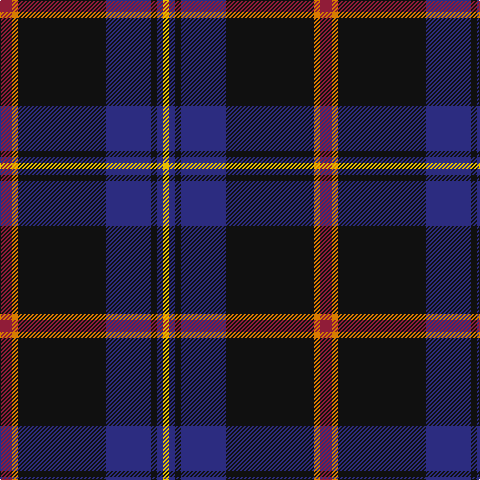

The parent of this is [City of Rome Pipe Band](/tartans/dr/12/o6/k88/db45/k6/db6/y/6/)

This was sourced from register-of-tartans.  It is a [7 stripes tartan](/stripes/stripes7/).

Original link https://www.tartanregister.gov.uk/tartanDetails.aspx?ref=4911

## Thread count
DR/12 O6 K88 DB45 K6 DB6 Y/6

## Palette
Each colour and its ΔE from the base-6 reference it is a variant of.

| Colour | Shade | Base | ΔE (OKLab) |
|---|---|---|---|
| DB |  `#2C2C80` | B  | 0.05 |
| DBa |  `#003C64` | B  | 0.07 |
| DR |  `#901C38` | R  | 0.12 |
| K |  `#101010` | K  | 0.17 |
| O |  `#D87C00` | Y  | 0.17 |
| Y |  `#E8C000` | Y  | 0.00 |

# Sample pattern

ID: /variants/dr/12/o6/k88/db45/k6/db6/y/6-db2c2c80-dba003c64-dr901c38-k101010-od87c00-ye8c000/
