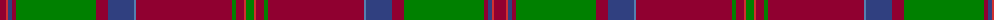

The parent of this is [MacDonald of Glencoe](/tartans/dr/12/r2/b4/dr4/g80/dr12/b26/ba2/dr96/g4/dr8/r2/g/8/)

This was sourced from weddslist.  It is a [13 stripes tartan](/stripes/stripes13/).

Original link http://www.weddslist.com/cgi-bin/tartans/pg.pl?source=sts

## Thread count
DR/12 R2 B4 DR4 G80 DR12 B26 Ba2 DR96 G4 DR8 R2 G/8

## Palette
Each colour and its ΔE from the base-6 reference it is a variant of.

| Colour | Shade | Base | ΔE (OKLab) |
|---|---|---|---|
| B |  `#304080` | B  | 0.01 |
| Ba |  `#5480B0` | B  | 0.20 |
| DR |  `#900030` | R  | 0.13 |
| G |  `#008000` | G  | 0.09 |
| R |  `#D03030` | R  | 0.05 |

ID: /variants/dr/12/r2/b4/dr4/g80/dr12/b26/ba2/dr96/g4/dr8/r2/g/8-b304080-ba5480b0-dr900030-g008000-rd03030/
