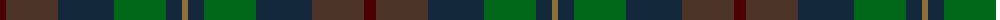
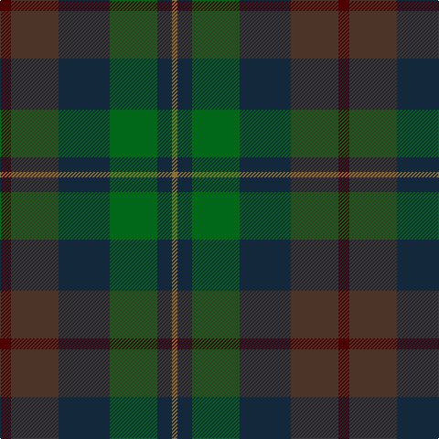

The parent of this is [House of Bruar (Corporate)](/tartans/dr/12/t52/dn56/g52/dn16/lt/6/)

This was sourced from tartans-authority.  It is a [6 stripes tartan](/stripes/stripes6/).

Original link http://www.tartansauthority.com/tartan-ferret/display/5219/

## Thread count
DR/12 T52 DN56 G52 DN16 LT/6

## Palette
Each colour and its ΔE from the base-6 reference it is a variant of.

| Colour | Shade | Base | ΔE (OKLab) |
|---|---|---|---|
| DN |  `#14283C` | B  | 0.14 |
| DR |  `#4C0000` | B  | 0.24 |
| G |  `#006818` | G  | 0.02 |
| LT |  `#8C7038` | G  | 0.18 |
| T |  `#4C3428` | B  | 0.16 |

# Sample pattern

ID: /variants/dr/12/t52/dn56/g52/dn16/lt/6-dn14283c-dr4c0000-g006818-lt8c7038-t4c3428/
