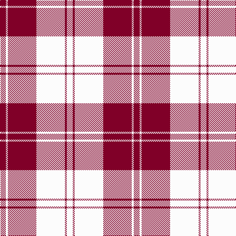

The parent of this is [Erskine, Burgundy (Dance)](/tartans/dr/12/w4/dr58/w58/dr4/w/12/)

This was sourced from tartans-authority.  It is a [6 stripes tartan](/stripes/stripes6/).

Original link http://www.tartansauthority.com/tartan-ferret/display/6535/

## Thread count
DR/12 W4 DR58 W58 DR4 W/12

## Palette
Each colour and its ΔE from the base-6 reference it is a variant of.

| Colour | Shade | Base | ΔE (OKLab) |
|---|---|---|---|
| DR |  `#800028` | R  | 0.16 |
| W |  `#FCFCFC` | W  | 0.03 |

# Sample pattern

ID: /variants/dr/12/w4/dr58/w58/dr4/w/12-dr800028-wfcfcfc/
