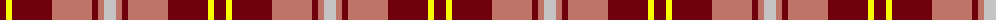

The parent of this is [Banff](/tartans/dr/12/y6/dr40/lt40/dr6/lt6/n/12/)

This was sourced from register-of-tartans.  It is a [7 stripes tartan](/stripes/stripes7/).

Original link https://www.tartanregister.gov.uk/tartanDetails.aspx?ref=5016

## Thread count
DR/12 Y6 DR40 LT40 DR6 LT6 N/12

## Palette
Each colour and its ΔE from the base-6 reference it is a variant of.

| Colour | Shade | Base | ΔE (OKLab) |
|---|---|---|---|
| DR |  `#70000C` | R  | 0.20 |
| LT |  `#C07468` | R  | 0.16 |
| N |  `#C4C4C4` | W  | 0.15 |
| Y |  `#FCFC00` | Y  | 0.16 |

# Sample pattern

ID: /variants/dr/12/y6/dr40/lt40/dr6/lt6/n/12-dr70000c-ltc07468-nc4c4c4-yfcfc00/
