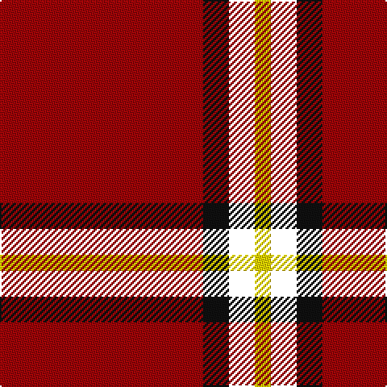

The parent of this is [McPeek (Fictitious clan)](/tartans/dr/126/k16/b16/y/10/)

This was sourced from register-of-tartans.  It is a [4 stripes tartan](/stripes/stripes4/).

Original link https://www.tartanregister.gov.uk/tartanDetails.aspx?ref=10188

## Thread count
DR/126 K16 B16 Y/10

## Palette
Each colour and its ΔE from the base-6 reference it is a variant of.

| Colour | Shade | Base | ΔE (OKLab) |
|---|---|---|---|
| DR |  `#9E0508` | R  | 0.09 |
| K |  `#101010` | K  | 0.17 |
| Y |  `#FFD700` | Y  | 0.07 |

# Sample pattern

ID: /variants/dr/126/k16/b16/y/10-dr9e0508-k101010-yffd700/
