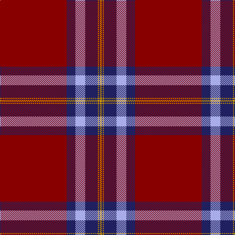

The parent of this is [Canadian Legion Br 50 (Corporate)](/tartans/dr/136/db18/lp20/db26/dy2/db2/dy/4/)

This was sourced from tartans-authority.  It is a [7 stripes tartan](/stripes/stripes7/).

Original link http://www.tartansauthority.com/tartan-ferret/display/1327/

## Thread count
DR/136 DB18 LP20 DB26 DY2 DB2 DY/4

## Palette
Each colour and its ΔE from the base-6 reference it is a variant of.

| Colour | Shade | Base | ΔE (OKLab) |
|---|---|---|---|
| DB |  `#202060` | B  | 0.11 |
| DR |  `#880000` | R  | 0.14 |
| DY |  `#D09800` | Y  | 0.11 |
| LP |  `#A8ACE8` | W  | 0.22 |

# Sample pattern

ID: /variants/dr/136/db18/lp20/db26/dy2/db2/dy/4-db202060-dr880000-dyd09800-lpa8ace8/
