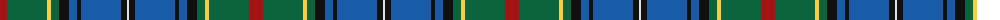

The parent of this is [McMeeken (Name)](/tartans/dr/14/g40/y4/g8/k10/b8/k4/b40/k6/ln/2/)

This was sourced from tartans-authority.  It is a [10 stripes tartan](/stripes/stripes10/).

Original link http://www.tartansauthority.com/tartan-ferret/display/10089/

## Thread count
DR/14 G40 Y4 G8 K10 B8 K4 B40 K6 LN/2

## Palette
Each colour and its ΔE from the base-6 reference it is a variant of.

| Colour | Shade | Base | ΔE (OKLab) |
|---|---|---|---|
| B |  `#185CA8` | B  | 0.09 |
| DR |  `#A41414` | R  | 0.07 |
| G |  `#0C643C` | G  | 0.06 |
| K |  `#101010` | K  | 0.17 |
| LN |  `#E0E0E0` | W  | 0.06 |
| Y |  `#FCCC3C` | Y  | 0.05 |

ID: /variants/dr/14/g40/y4/g8/k10/b8/k4/b40/k6/ln/2-b185ca8-dra41414-g0c643c-k101010-lne0e0e0-yfccc3c/
