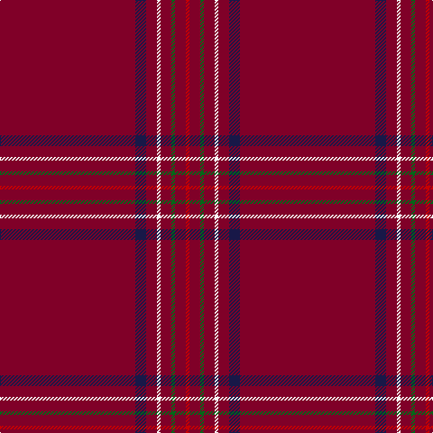

The parent of this is [Burnett of Leys Htg (Clan)](/tartans/dr/150/db12/dr12/w4/dr12/g4/dr12/r/4/)

This was sourced from tartans-authority.  It is a [8 stripes tartan](/stripes/stripes8/).

Original link http://www.tartansauthority.com/tartan-ferret/display/1657/

## Thread count
DR/150 DB12 DR12 W4 DR12 G4 DR12 R/4

## Palette
Each colour and its ΔE from the base-6 reference it is a variant of.

| Colour | Shade | Base | ΔE (OKLab) |
|---|---|---|---|
| DB |  `#181848` | B  | 0.16 |
| DR |  `#800028` | R  | 0.16 |
| G |  `#006818` | G  | 0.02 |
| R |  `#C80000` | R  | 0.00 |
| W |  `#F8F8F8` | W  | 0.01 |

# Sample pattern

ID: /variants/dr/150/db12/dr12/w4/dr12/g4/dr12/r/4-db181848-dr800028-g006818-rc80000-wf8f8f8/
