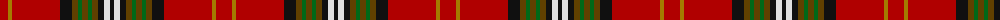

The parent of this is [Burns 250th Anniversary (Commem.)](/tartans/dr/16/dy4/dr48/k12/t6/g4/t6/g4/t6/k6/ln6/k/4/)

This was sourced from tartans-authority.  It is a [12 stripes tartan](/stripes/stripes12/).

Original link http://www.tartansauthority.com/tartan-ferret/display/7701/

## Thread count
DR/16 DY4 DR48 K12 T6 G4 T6 G4 T6 K6 LN6 K/4

## Palette
Each colour and its ΔE from the base-6 reference it is a variant of.

| Colour | Shade | Base | ΔE (OKLab) |
|---|---|---|---|
| DR |  `#B00000` | R  | 0.05 |
| DY |  `#A47C00` | R  | 0.20 |
| G |  `#006818` | G  | 0.02 |
| K |  `#101010` | K  | 0.17 |
| LN |  `#E0E0E0` | W  | 0.06 |
| T |  `#604000` | G  | 0.14 |

ID: /variants/dr/16/dy4/dr48/k12/t6/g4/t6/g4/t6/k6/ln6/k/4-drb00000-dya47c00-g006818-k101010-lne0e0e0-t604000/
