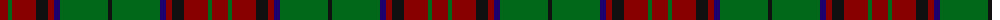

The parent of this is [McInery (Personal)](/tartans/dr/16/g4/dr24/k12/dr6/db6/g48/k/4/)

This was sourced from tartans-authority.  It is a [8 stripes tartan](/stripes/stripes8/).

Original link http://www.tartansauthority.com/tartan-ferret/display/3391/

## Thread count
DR/16 G4 DR24 K12 DR6 DB6 G48 K/4

## Palette
Each colour and its ΔE from the base-6 reference it is a variant of.

| Colour | Shade | Base | ΔE (OKLab) |
|---|---|---|---|
| DB |  `#1C0070` | B  | 0.14 |
| DR |  `#880000` | R  | 0.14 |
| G |  `#006818` | G  | 0.02 |
| K |  `#101010` | K  | 0.17 |

# Sample pattern

ID: /variants/dr/16/g4/dr24/k12/dr6/db6/g48/k/4-db1c0070-dr880000-g006818-k101010/
