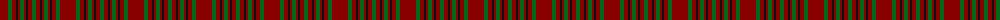

The parent of this is [Waverley Care Aids Trust](/tartans/dr/16/g4/dr4/k2/dr2/g4/dr2/k2/dr4/g/4/)

This was sourced from register-of-tartans.  It is a [10 stripes tartan](/stripes/stripes10/).

Original link https://www.tartanregister.gov.uk/tartanDetails.aspx?ref=5147

## Thread count
DR/16 G4 DR4 K2 DR2 G4 DR2 K2 DR4 G/4

## Palette
Each colour and its ΔE from the base-6 reference it is a variant of.

| Colour | Shade | Base | ΔE (OKLab) |
|---|---|---|---|
| DG |  `#003820` | G  | 0.16 |
| DR |  `#880000` | R  | 0.14 |
| G |  `#006818` | G  | 0.02 |
| K |  `#101010` | K  | 0.17 |

ID: /variants/dr/16/g4/dr4/k2/dr2/g4/dr2/k2/dr4/g/4-dg003820-dr880000-g006818-k101010/
