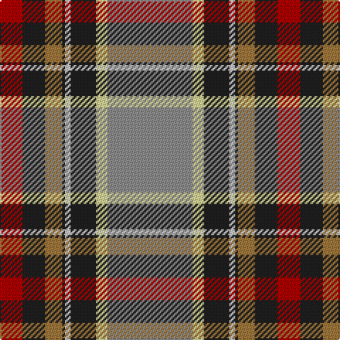

The parent of this is [Norwegian Migration Period (Artefact](/tartans/dr/16/k16/lt12/k2/n4/k18/ly8/na/60/)

This was sourced from tartans-authority.  It is a [8 stripes tartan](/stripes/stripes8/).

Original link http://www.tartansauthority.com/tartan-ferret/display/5584/

## Thread count
DR/16 K16 LT12 K2 N4 K18 LY8 Na/60

## Palette
Each colour and its ΔE from the base-6 reference it is a variant of.

| Colour | Shade | Base | ΔE (OKLab) |
|---|---|---|---|
| DR |  `#B00000` | R  | 0.05 |
| K |  `#202020` | B  | 0.19 |
| LT |  `#A0783C` | R  | 0.18 |
| LY |  `#D8D898` | Y  | 0.10 |
| N |  `#C8C8C8` | W  | 0.13 |
| Na |  `#8C8C8C` | R  | 0.24 |

# Sample pattern

ID: /variants/dr/16/k16/lt12/k2/n4/k18/ly8/na/60-drb00000-k202020-lta0783c-lyd8d898-nc8c8c8-na8c8c8c/
