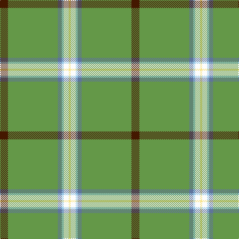

The parent of this is [Greenup (2015)](/tartans/dr/16/lg100/b8/lb4/w10/ly/4/)

This was sourced from register-of-tartans.  It is a [6 stripes tartan](/stripes/stripes6/).

Original link https://www.tartanregister.gov.uk/tartanDetails.aspx?ref=11308

## Thread count
DR/16 LG100 B8 LB4 W10 LY/4

## Palette
Each colour and its ΔE from the base-6 reference it is a variant of.

| Colour | Shade | Base | ΔE (OKLab) |
|---|---|---|---|
| B |  `#5F749C` | B  | 0.17 |
| DR |  `#441800` | B  | 0.22 |
| LB |  `#98C8E8` | W  | 0.17 |
| LG |  `#649848` | G  | 0.19 |
| LY |  `#F8E38C` | Y  | 0.11 |
| W |  `#FCFCFC` | W  | 0.03 |

# Sample pattern

ID: /variants/dr/16/lg100/b8/lb4/w10/ly/4-b5f749c-dr441800-lb98c8e8-lg649848-lyf8e38c-wfcfcfc/
