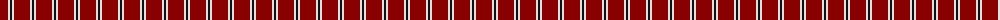
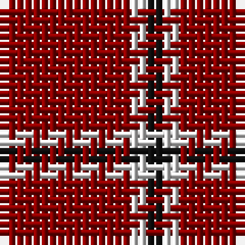

The parent of this is [International Karate Fed. (Corporat)](/tartans/dr/16/ln2/k/2/)

This was sourced from tartans-authority.  It is a [3 stripes tartan](/stripes/stripes3/).

Original link http://www.tartansauthority.com/tartan-ferret/display/7543/

## Thread count
DR/16 LN2 K/2

## Palette
Each colour and its ΔE from the base-6 reference it is a variant of.

| Colour | Shade | Base | ΔE (OKLab) |
|---|---|---|---|
| DR |  `#880000` | R  | 0.14 |
| K |  `#101010` | K  | 0.17 |
| LN |  `#E0E0E0` | W  | 0.06 |

# Sample pattern

ID: /variants/dr/16/ln2/k/2-dr880000-k101010-lne0e0e0/
