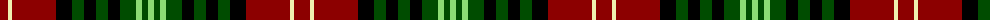

The parent of this is [Wcwm 1712](/tartans/dr/16/ly4/dr44/k16/g12/k12/g12/k12/g16/lg6/g6/lg/6/)

This was sourced from register-of-tartans.  It is a [12 stripes tartan](/stripes/stripes12/).

Original link https://www.tartanregister.gov.uk/tartanDetails.aspx?ref=4541

## Thread count
DR/16 LY4 DR44 K16 G12 K12 G12 K12 G16 LG6 G6 LG/6

## Palette
Each colour and its ΔE from the base-6 reference it is a variant of.

| Colour | Shade | Base | ΔE (OKLab) |
|---|---|---|---|
| DR |  `#8C0000` | R  | 0.13 |
| G |  `#004C00` | G  | 0.08 |
| K |  `#000000` | K  | 0.00 |
| LG |  `#8CDC74` | Y  | 0.13 |
| LY |  `#F0F0B0` | W  | 0.08 |

ID: /variants/dr/16/ly4/dr44/k16/g12/k12/g12/k12/g16/lg6/g6/lg/6-dr8c0000-g004c00-k000000-lg8cdc74-lyf0f0b0/
