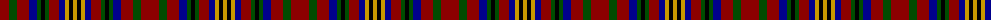

The parent of this is [Westgaard Htg (Personal)](/tartans/dr/18/g8/dr12/db8/g4/k4/g4/dr10/db6/dy4/k4/dy/4/)

This was sourced from tartans-authority.  It is a [12 stripes tartan](/stripes/stripes12/).

Original link http://www.tartansauthority.com/tartan-ferret/display/4250/

## Thread count
DR/18 G8 DR12 DB8 G4 K4 G4 DR10 DB6 DY4 K4 DY/4

## Palette
Each colour and its ΔE from the base-6 reference it is a variant of.

| Colour | Shade | Base | ΔE (OKLab) |
|---|---|---|---|
| DB |  `#00008C` | B  | 0.13 |
| DR |  `#8C0000` | R  | 0.13 |
| DY |  `#C89800` | Y  | 0.12 |
| G |  `#004C00` | G  | 0.08 |
| K |  `#000000` | K  | 0.00 |

ID: /variants/dr/18/g8/dr12/db8/g4/k4/g4/dr10/db6/dy4/k4/dy/4-db00008c-dr8c0000-dyc89800-g004c00-k000000/
