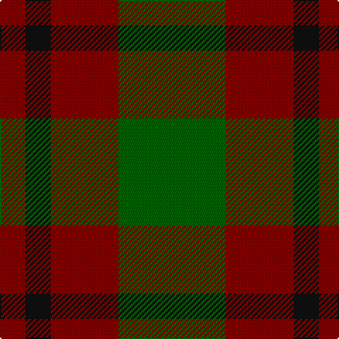

The parent of this is [Royal Guard of Oman 4th Band Squadron](/tartans/dr/18/k18/dr48/g/76/)

This was sourced from register-of-tartans.  It is a [4 stripes tartan](/stripes/stripes4/).

Original link https://www.tartanregister.gov.uk/tartanDetails.aspx?ref=10991

## Thread count
DR/18 K18 DR48 G/76

## Palette
Each colour and its ΔE from the base-6 reference it is a variant of.

| Colour | Shade | Base | ΔE (OKLab) |
|---|---|---|---|
| DR |  `#880000` | R  | 0.14 |
| G |  `#006400` | G  | 0.00 |
| K |  `#101010` | K  | 0.17 |

# Sample pattern

ID: /variants/dr/18/k18/dr48/g/76-dr880000-g006400-k101010/
