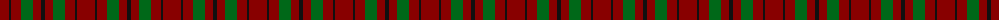
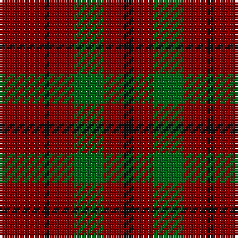

The parent of this is [MacAn of Lurgyvallan (Hose)](/tartans/dr/18/k2/dr10/g12/dr8/k/4/)

This was sourced from register-of-tartans.  It is a [6 stripes tartan](/stripes/stripes6/).

Original link https://www.tartanregister.gov.uk/tartanDetails.aspx?ref=2277

## Thread count
DR/18 K2 DR10 G12 DR8 K/4

## Palette
Each colour and its ΔE from the base-6 reference it is a variant of.

| Colour | Shade | Base | ΔE (OKLab) |
|---|---|---|---|
| DR |  `#880000` | R  | 0.14 |
| G |  `#006818` | G  | 0.02 |
| K |  `#101010` | K  | 0.17 |

# Sample pattern

ID: /variants/dr/18/k2/dr10/g12/dr8/k/4-dr880000-g006818-k101010/
