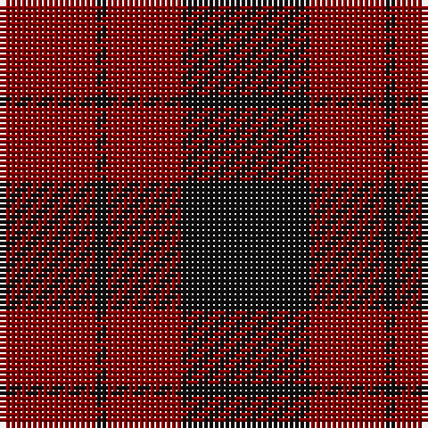

The parent of this is [Lendrum (Black & Red)](/tartans/dr/18/k2/dr14/k/24/)

This was sourced from tartans-authority.  It is a [4 stripes tartan](/stripes/stripes4/).

Original link http://www.tartansauthority.com/tartan-ferret/display/1190/

## Thread count
DR/18 K2 DR14 K/24

## Palette
Each colour and its ΔE from the base-6 reference it is a variant of.

| Colour | Shade | Base | ΔE (OKLab) |
|---|---|---|---|
| DR |  `#880000` | R  | 0.14 |
| K |  `#101010` | K  | 0.17 |

# Sample pattern

ID: /variants/dr/18/k2/dr14/k/24-dr880000-k101010/
