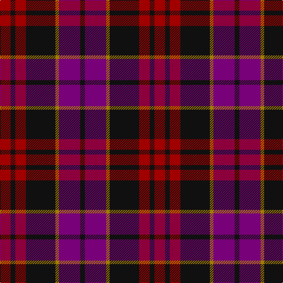

The parent of this is [Wounded Warriors Canada](/tartans/dr/18/k8/dr18/k50/dy6/p36/k/8/)

This was sourced from register-of-tartans.  It is a [7 stripes tartan](/stripes/stripes7/).

Original link https://www.tartanregister.gov.uk/tartanDetails.aspx?ref=11215

## Thread count
DR/18 K8 DR18 K50 DY6 P36 K/8

## Palette
Each colour and its ΔE from the base-6 reference it is a variant of.

| Colour | Shade | Base | ΔE (OKLab) |
|---|---|---|---|
| DR |  `#A00000` | R  | 0.09 |
| DY |  `#A07C00` | R  | 0.20 |
| K |  `#101010` | K  | 0.17 |
| P |  `#780078` | B  | 0.16 |

# Sample pattern

ID: /variants/dr/18/k8/dr18/k50/dy6/p36/k/8-dra00000-dya07c00-k101010-p780078/
