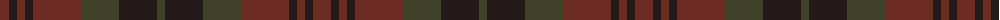

The parent of this is [Chindecella Ruadh (Kemete Heil)](/tartans/dr/18/k8/dr8/k8/dr48/t38/k38/t/8/)

This was sourced from register-of-tartans.  It is a [8 stripes tartan](/stripes/stripes8/).

Original link https://www.tartanregister.gov.uk/tartanDetails.aspx?ref=10253

## Thread count
DR/18 K8 DR8 K8 DR48 T38 K38 T/8

## Palette
Each colour and its ΔE from the base-6 reference it is a variant of.

| Colour | Shade | Base | ΔE (OKLab) |
|---|---|---|---|
| DR |  `#6C2C23` | B  | 0.18 |
| K |  `#241A19` | B  | 0.21 |
| T |  `#3F4129` | G  | 0.14 |

# Sample pattern

ID: /variants/dr/18/k8/dr8/k8/dr48/t38/k38/t/8-dr6c2c23-k241a19-t3f4129/
