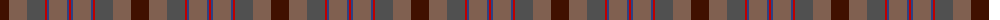
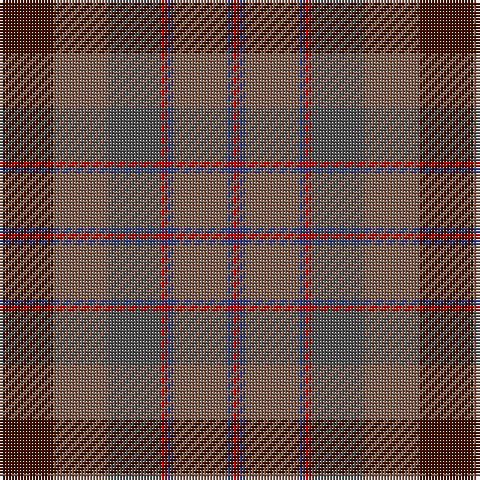

The parent of this is [Jardine, of Castlemilk](/tartans/dr/18/lt18/n18/r2/b2/lt18/b2/r/2/)

This was sourced from weddslist.  It is a [8 stripes tartan](/stripes/stripes8/).

Original link http://www.weddslist.com/cgi-bin/tartans/pg.pl?source=sts

## Thread count
DR/18 LT18 N18 R2 B2 LT18 B2 R/2

## Palette
Each colour and its ΔE from the base-6 reference it is a variant of.

| Colour | Shade | Base | ΔE (OKLab) |
|---|---|---|---|
| B |  `#304080` | B  | 0.01 |
| DR |  `#401000` | B  | 0.23 |
| LT |  `#806050` | R  | 0.17 |
| N |  `#505050` | B  | 0.12 |
| R |  `#C00000` | R  | 0.02 |

# Sample pattern

ID: /variants/dr/18/lt18/n18/r2/b2/lt18/b2/r/2-b304080-dr401000-lt806050-n505050-rc00000/
