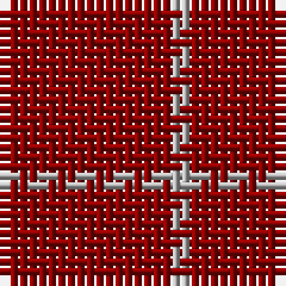

The parent of this is [Roddy "Rowdy" Piper (Personal)](/tartans/dr/18/n/2/)

This was sourced from tartans-authority.  It is a [2 stripes tartan](/stripes/stripes2/).

Original link http://www.tartansauthority.com/tartan-ferret/display/5411/

## Thread count
DR/18 N/2

## Palette
Each colour and its ΔE from the base-6 reference it is a variant of.

| Colour | Shade | Base | ΔE (OKLab) |
|---|---|---|---|
| DR |  `#8C0000` | R  | 0.13 |
| N |  `#B0B0B0` | Y  | 0.18 |

# Sample pattern

ID: /variants/dr/18/n/2-dr8c0000-nb0b0b0/
