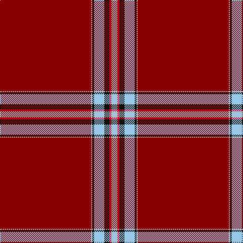

The parent of this is [Lock in Northumberland (Name)](/tartans/dr/180/n2/k4/lb20/k10/r4/n4/lb/4/)

This was sourced from tartans-authority.  It is a [8 stripes tartan](/stripes/stripes8/).

Original link http://www.tartansauthority.com/tartan-ferret/display/10445/

## Thread count
DR/180 N2 K4 LB20 K10 R4 N4 LB/4

## Palette
Each colour and its ΔE from the base-6 reference it is a variant of.

| Colour | Shade | Base | ΔE (OKLab) |
|---|---|---|---|
| DR |  `#880000` | R  | 0.14 |
| K |  `#101010` | K  | 0.17 |
| LB |  `#98C8E8` | W  | 0.17 |
| N |  `#B8B8B8` | Y  | 0.17 |
| R |  `#C8002C` | R  | 0.03 |

# Sample pattern

ID: /variants/dr/180/n2/k4/lb20/k10/r4/n4/lb/4-dr880000-k101010-lb98c8e8-nb8b8b8-rc8002c/
