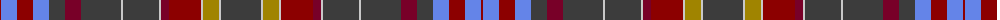

The parent of this is [Wcwm 1717](/tartans/dr/2/b16/dr16/b16/n16/dra16/n40/na2/n36/na2/dra8/dr32/na2/lg16/na2/n/40/)

This was sourced from register-of-tartans.  It is a [16 stripes tartan](/stripes/stripes16/).

Original link https://www.tartanregister.gov.uk/tartanDetails.aspx?ref=4544

## Thread count
DR/2 B16 DR16 B16 N16 DRa16 N40 Na2 N36 Na2 DRa8 DR32 Na2 LG16 Na2 N/40

## Palette
Each colour and its ΔE from the base-6 reference it is a variant of.

| Colour | Shade | Base | ΔE (OKLab) |
|---|---|---|---|
| B |  `#6484E8` | B  | 0.25 |
| DR |  `#8C0000` | R  | 0.13 |
| DRa |  `#780028` | R  | 0.18 |
| LG |  `#A08400` | Y  | 0.20 |
| N |  `#3C3C3C` | B  | 0.12 |
| Na |  `#C8C8C8` | W  | 0.13 |

ID: /variants/dr/2/b16/dr16/b16/n16/dra16/n40/na2/n36/na2/dra8/dr32/na2/lg16/na2/n/40-b6484e8-dr8c0000-dra780028-lga08400-n3c3c3c-nac8c8c8/
