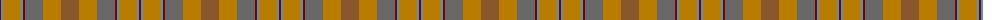
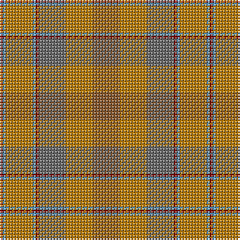

The parent of this is [Jardine of Castlemilk Family Tartan Tartan Number: 1432. Earliest known date: c.1978 The chiefly house is Jardine of Applegirth, a baronetcy created in 1672. The Jardines of Castlemilk in Dumfriesshire settled there in the early fourteenth century. The tartan is approved by Col Jardine. The darker brown is recorded as "J.Br", and the lighter as "Olive Br" in the Lyon Books. See products available Copyright © Blair Urquhart, Comrie, 2015](/tartans/dr/2/b2/dy18/b2/dr2/n18/dy18/lt/18/)

This was sourced from house-of-tartan.  It is a [8 stripes tartan](/stripes/stripes8/).

Original link http://www.house-of-tartan.scotland.net/house/TartanViewjs.asp?colr=Def&tnam=1432

## Thread count
DR/2 B2 DY18 B2 DR2 N18 DY18 LT/18

## Palette
Each colour and its ΔE from the base-6 reference it is a variant of.

| Colour | Shade | Base | ΔE (OKLab) |
|---|---|---|---|
| B |  `#5494BC` | B  | 0.25 |
| DR |  `#7C0000` | R  | 0.17 |
| DY |  `#B87C00` | R  | 0.19 |
| LT |  `#88582C` | R  | 0.15 |
| N |  `#686868` | G  | 0.17 |

# Sample pattern

ID: /variants/dr/2/b2/dy18/b2/dr2/n18/dy18/lt/18-b5494bc-dr7c0000-dyb87c00-lt88582c-n686868/
