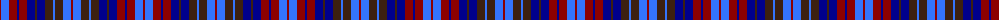

The parent of this is [Vincent (WCWM - Fashion)](/tartans/dr/2/b8/dr8/db2/dr8/db8/k2/db8/k8/b2/k8/b8/dr/2/)

This was sourced from tartans-authority.  It is a [13 stripes tartan](/stripes/stripes13/).

Original link http://www.tartansauthority.com/tartan-ferret/display/4342/

## Thread count
DR/2 B8 DR8 DB2 DR8 DB8 K2 DB8 K8 B2 K8 B8 DR/2

## Palette
Each colour and its ΔE from the base-6 reference it is a variant of.

| Colour | Shade | Base | ΔE (OKLab) |
|---|---|---|---|
| B |  `#3474FC` | B  | 0.23 |
| DB |  `#00008C` | B  | 0.13 |
| DR |  `#8C0000` | R  | 0.13 |
| K |  `#3C2010` | B  | 0.20 |

ID: /variants/dr/2/b8/dr8/db2/dr8/db8/k2/db8/k8/b2/k8/b8/dr/2-b3474fc-db00008c-dr8c0000-k3c2010/
