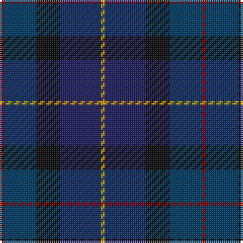

The parent of this is [Sanix Modern (Fashion)](/tartans/dr/2/db16/k12/dba20/dy/2/)

This was sourced from tartans-authority.  It is a [5 stripes tartan](/stripes/stripes5/).

Original link http://www.tartansauthority.com/tartan-ferret/display/2643/

## Thread count
DR/2 DB16 K12 DBa20 DY/2

## Palette
Each colour and its ΔE from the base-6 reference it is a variant of.

| Colour | Shade | Base | ΔE (OKLab) |
|---|---|---|---|
| DB |  `#003C64` | B  | 0.07 |
| DBa |  `#202060` | B  | 0.11 |
| DR |  `#880000` | R  | 0.14 |
| DY |  `#D09800` | Y  | 0.11 |
| K |  `#101010` | K  | 0.17 |

# Sample pattern

ID: /variants/dr/2/db16/k12/dba20/dy/2-db003c64-dba202060-dr880000-dyd09800-k101010/
