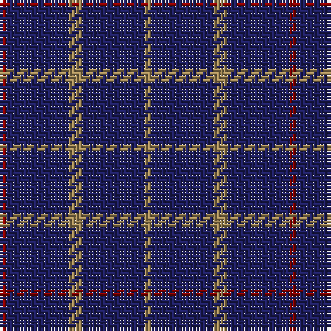

The parent of this is [Brooks Bros Tattersall Blue (Fashion](/tartans/dr/2/db18/lt4/db18/lt/2/)

This was sourced from tartans-authority.  It is a [5 stripes tartan](/stripes/stripes5/).

Original link http://www.tartansauthority.com/tartan-ferret/display/6573/

## Thread count
DR/2 DB18 LT4 DB18 LT/2

## Palette
Each colour and its ΔE from the base-6 reference it is a variant of.

| Colour | Shade | Base | ΔE (OKLab) |
|---|---|---|---|
| DB |  `#202060` | B  | 0.11 |
| DR |  `#880000` | R  | 0.14 |
| LT |  `#A08858` | Y  | 0.21 |

# Sample pattern

ID: /variants/dr/2/db18/lt4/db18/lt/2-db202060-dr880000-lta08858/
