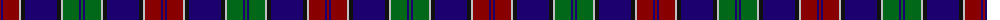

The parent of this is [MacMichael](/tartans/dr/2/db2/dr16/n2/k4/db32/k4/n2/g16/db2/g/2/)

This was sourced from tartans-authority.  It is a [11 stripes tartan](/stripes/stripes11/).

Original link http://www.tartansauthority.com/tartan-ferret/display/2063/

## Thread count
DR/2 DB2 DR16 N2 K4 DB32 K4 N2 G16 DB2 G/2

## Palette
Each colour and its ΔE from the base-6 reference it is a variant of.

| Colour | Shade | Base | ΔE (OKLab) |
|---|---|---|---|
| DB |  `#1C0070` | B  | 0.14 |
| DR |  `#880000` | R  | 0.14 |
| G |  `#006818` | G  | 0.02 |
| K |  `#101010` | K  | 0.17 |
| N |  `#C0C0C0` | W  | 0.16 |

ID: /variants/dr/2/db2/dr16/n2/k4/db32/k4/n2/g16/db2/g/2-db1c0070-dr880000-g006818-k101010-nc0c0c0/
