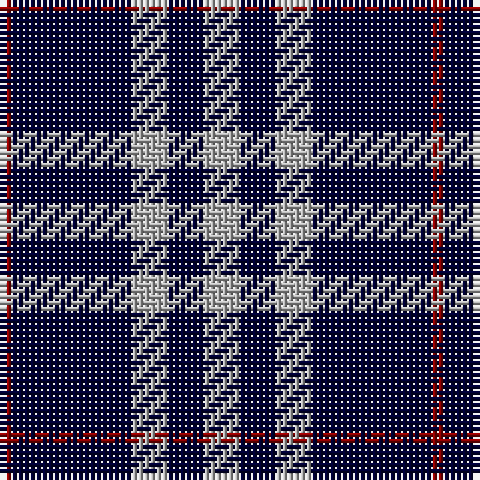

The parent of this is [Burberry Blue](/tartans/dr/2/db20/n6/db6/n/6/)

This was sourced from register-of-tartans.  It is a [5 stripes tartan](/stripes/stripes5/).

Original link https://www.tartanregister.gov.uk/tartanDetails.aspx?ref=5382

## Thread count
DR/2 DB20 N6 DB6 N/6

## Palette
Each colour and its ΔE from the base-6 reference it is a variant of.

| Colour | Shade | Base | ΔE (OKLab) |
|---|---|---|---|
| DB |  `#000034` | K  | 0.18 |
| DR |  `#8C0000` | R  | 0.13 |
| N |  `#B0B0B0` | Y  | 0.18 |

# Sample pattern

ID: /variants/dr/2/db20/n6/db6/n/6-db000034-dr8c0000-nb0b0b0/
