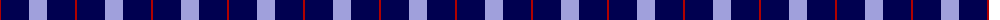
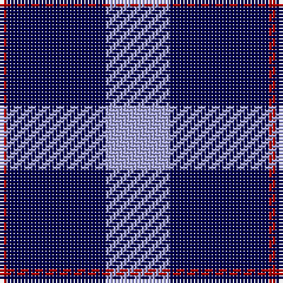

The parent of this is [Stakis Hotels](/tartans/dr/2/db28/lp/18/)

This was sourced from register-of-tartans.  It is a [3 stripes tartan](/stripes/stripes3/).

Original link https://www.tartanregister.gov.uk/tartanDetails.aspx?ref=3907

## Thread count
DR/2 DB28 LP/18

## Palette
Each colour and its ΔE from the base-6 reference it is a variant of.

| Colour | Shade | Base | ΔE (OKLab) |
|---|---|---|---|
| B |  `#788CB4` | B  | 0.25 |
| DB |  `#000050` | B  | 0.20 |
| DR |  `#B00000` | R  | 0.05 |
| DY |  `#C88C00` | Y  | 0.15 |
| K |  `#000000` | K  | 0.00 |
| LP |  `#A0A0DC` | W  | 0.26 |
| N |  `#C8C8C8` | W  | 0.13 |
| P |  `#64008C` | B  | 0.13 |

# Sample pattern

ID: /variants/dr/2/db28/lp/18-b788cb4-db000050-drb00000-dyc88c00-k000000-lpa0a0dc-nc8c8c8-p64008c/
