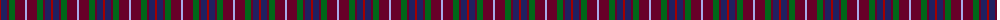
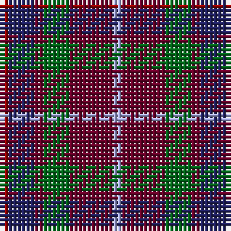

The parent of this is [Lanark (Fashion #1)](/tartans/dr/2/db6/dra2/g6/dra10/lp/2/)

This was sourced from register-of-tartans.  It is a [6 stripes tartan](/stripes/stripes6/).

Original link https://www.tartanregister.gov.uk/tartanDetails.aspx?ref=4975

## Thread count
DR/2 DB6 DRa2 G6 DRa10 LP/2

## Palette
Each colour and its ΔE from the base-6 reference it is a variant of.

| Colour | Shade | Base | ΔE (OKLab) |
|---|---|---|---|
| DB |  `#202060` | B  | 0.11 |
| DR |  `#A00000` | R  | 0.09 |
| DRa |  `#680028` | B  | 0.20 |
| G |  `#006818` | G  | 0.02 |
| LP |  `#A8ACE8` | W  | 0.22 |

# Sample pattern

ID: /variants/dr/2/db6/dra2/g6/dra10/lp/2-db202060-dra00000-dra680028-g006818-lpa8ace8/
