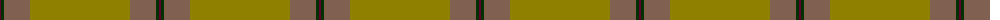

The parent of this is [13, Irish Regiment](/tartans/dr/2/dg3/lt26/lg/100/)

This was sourced from weddslist.  It is a [4 stripes tartan](/stripes/stripes4/).

Original link http://www.weddslist.com/cgi-bin/tartans/pg.pl?source=sts

## Thread count
DR/2 DG3 LT26 LG/100

## Palette
Each colour and its ΔE from the base-6 reference it is a variant of.

| Colour | Shade | Base | ΔE (OKLab) |
|---|---|---|---|
| DG |  `#003000` | G  | 0.18 |
| DR |  `#600030` | B  | 0.19 |
| LG |  `#908000` | G  | 0.19 |
| LT |  `#806050` | R  | 0.17 |

# Sample pattern

ID: /variants/dr/2/dg3/lt26/lg/100-dg003000-dr600030-lg908000-lt806050/
