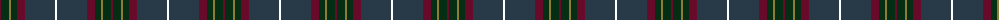
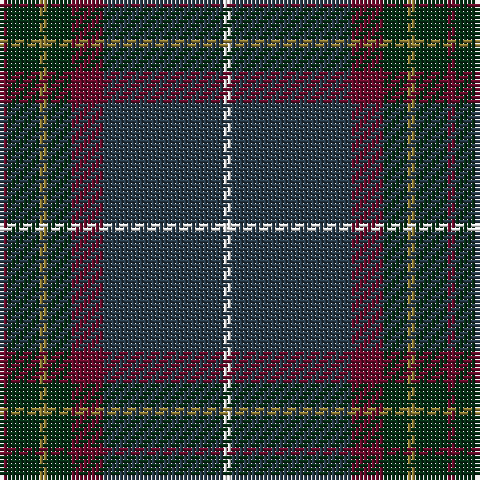

The parent of this is [Bressuire](/tartans/dr/2/dg8/lt2/dg6/dr8/dn30/w/2/)

This was sourced from register-of-tartans.  It is a [7 stripes tartan](/stripes/stripes7/).

Original link https://www.tartanregister.gov.uk/tartanDetails.aspx?ref=10260

## Thread count
DR/2 DG8 LT2 DG6 DR8 DN30 W/2

## Palette
Each colour and its ΔE from the base-6 reference it is a variant of.

| Colour | Shade | Base | ΔE (OKLab) |
|---|---|---|---|
| DG |  `#062E14` | G  | 0.19 |
| DN |  `#283A48` | B  | 0.10 |
| DR |  `#680B2A` | B  | 0.19 |
| LT |  `#8E7C34` | G  | 0.19 |
| W |  `#FFFFFF` | W  | 0.03 |

# Sample pattern

ID: /variants/dr/2/dg8/lt2/dg6/dr8/dn30/w/2-dg062e14-dn283a48-dr680b2a-lt8e7c34-wffffff/
