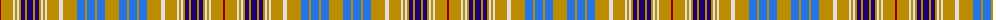

The parent of this is [Ottawa (District)](/tartans/dr/2/dy12/ln2/dy2/ln2/dy2/db4/dy2/db6/dy2/db4/dy2/ln2/dy2/ln2/dy12/ln4/dy14/b8/dy2/b8/dy2/b8/dy/14/)

This was sourced from tartans-authority.  It is a [24 stripes tartan](/stripes/stripes24/).

Original link http://www.tartansauthority.com/tartan-ferret/display/2021/

## Thread count
DR/2 DY12 LN2 DY2 LN2 DY2 DB4 DY2 DB6 DY2 DB4 DY2 LN2 DY2 LN2 DY12 LN4 DY14 B8 DY2 B8 DY2 B8 DY/14

## Palette
Each colour and its ΔE from the base-6 reference it is a variant of.

| Colour | Shade | Base | ΔE (OKLab) |
|---|---|---|---|
| B |  `#2474E8` | B  | 0.20 |
| DB |  `#1C0070` | B  | 0.14 |
| DR |  `#880000` | R  | 0.14 |
| DY |  `#BC8C00` | Y  | 0.16 |
| LN |  `#E0E0E0` | W  | 0.06 |

ID: /variants/dr/2/dy12/ln2/dy2/ln2/dy2/db4/dy2/db6/dy2/db4/dy2/ln2/dy2/ln2/dy12/ln4/dy14/b8/dy2/b8/dy2/b8/dy/14-b2474e8-db1c0070-dr880000-dybc8c00-lne0e0e0/
