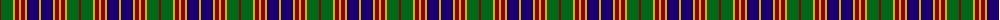

The parent of this is [Stevenson (Name)](/tartans/dr/2/g12/y2/dr4/y2/dr4/y2/db12/y/2/)

This was sourced from tartans-authority.  It is a [9 stripes tartan](/stripes/stripes9/).

Original link http://www.tartansauthority.com/tartan-ferret/display/1558/

## Thread count
DR/2 G12 Y2 DR4 Y2 DR4 Y2 DB12 Y/2

## Palette
Each colour and its ΔE from the base-6 reference it is a variant of.

| Colour | Shade | Base | ΔE (OKLab) |
|---|---|---|---|
| DB |  `#1C0070` | B  | 0.14 |
| DR |  `#880000` | R  | 0.14 |
| G |  `#006818` | G  | 0.02 |
| Y |  `#D8B000` | Y  | 0.05 |

ID: /variants/dr/2/g12/y2/dr4/y2/dr4/y2/db12/y/2-db1c0070-dr880000-g006818-yd8b000/
