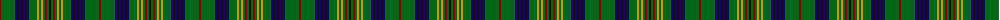

The parent of this is [Myron (Fashion)](/tartans/dr/2/g14/db2/k2/db2/k2/db2/k2/db2/g8/dy2/g2/dy2/g2/dr2/g2/k/2/)

This was sourced from tartans-authority.  It is a [17 stripes tartan](/stripes/stripes17/).

Original link http://www.tartansauthority.com/tartan-ferret/display/1105/

## Thread count
DR/2 G14 DB2 K2 DB2 K2 DB2 K2 DB2 G8 DY2 G2 DY2 G2 DR2 G2 K/2

## Palette
Each colour and its ΔE from the base-6 reference it is a variant of.

| Colour | Shade | Base | ΔE (OKLab) |
|---|---|---|---|
| DB |  `#1C0070` | B  | 0.14 |
| DR |  `#880000` | R  | 0.14 |
| DY |  `#D09800` | Y  | 0.11 |
| G |  `#006818` | G  | 0.02 |
| K |  `#101010` | K  | 0.17 |

ID: /variants/dr/2/g14/db2/k2/db2/k2/db2/k2/db2/g8/dy2/g2/dy2/g2/dr2/g2/k/2-db1c0070-dr880000-dyd09800-g006818-k101010/
