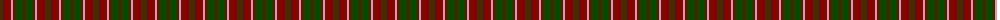
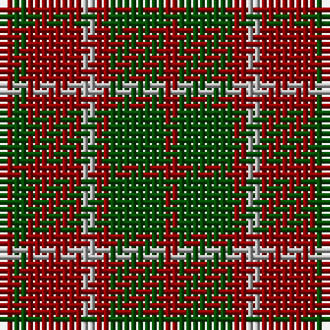

The parent of this is [Unidentified #59](/tartans/dr/2/g2/dr8/n2/dr2/g8/dr/2/)

This was sourced from register-of-tartans.  It is a [7 stripes tartan](/stripes/stripes7/).

Original link https://www.tartanregister.gov.uk/tartanDetails.aspx?ref=4260

## Thread count
DR/2 G2 DR8 N2 DR2 G8 DR/2

## Palette
Each colour and its ΔE from the base-6 reference it is a variant of.

| Colour | Shade | Base | ΔE (OKLab) |
|---|---|---|---|
| DR |  `#8C0000` | R  | 0.13 |
| G |  `#004C00` | G  | 0.08 |
| N |  `#B0B0B0` | Y  | 0.18 |

# Sample pattern

ID: /variants/dr/2/g2/dr8/n2/dr2/g8/dr/2-dr8c0000-g004c00-nb0b0b0/
