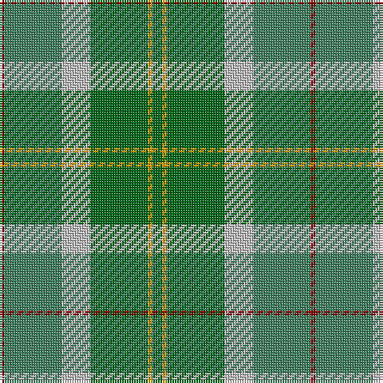

The parent of this is [City of Vancouver (Commemorative)](/tartans/dr/2/g24/n12/ga24/dy2/ga/4/)

This was sourced from tartans-authority.  It is a [6 stripes tartan](/stripes/stripes6/).

Original link http://www.tartansauthority.com/tartan-ferret/display/2083/

## Thread count
DR/2 G24 N12 Ga24 DY2 Ga/4

## Palette
Each colour and its ΔE from the base-6 reference it is a variant of.

| Colour | Shade | Base | ΔE (OKLab) |
|---|---|---|---|
| DR |  `#880000` | R  | 0.14 |
| DY |  `#D09800` | Y  | 0.11 |
| G |  `#408060` | G  | 0.13 |
| Ga |  `#006818` | G  | 0.02 |
| N |  `#C0C0C0` | W  | 0.16 |

# Sample pattern

ID: /variants/dr/2/g24/n12/ga24/dy2/ga/4-dr880000-dyd09800-g408060-ga006818-nc0c0c0/
