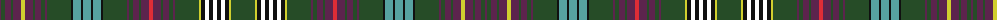

The parent of this is [Lodge Dunblane Australis No.966](/tartans/dr/2/g4/dr6/g2/dr8/y4/dr8/g2/dr6/g4/dr2/g24/k2/b8/k2/b8/k2/b8/k2/g24/dr2/g4/dr6/g2/dr8/r4/dr8/g2/dr6/g4/dr2/g24/y2/k4/w4/k4/w4/k4/w4/k4/y2/g/24/)

This was sourced from register-of-tartans.  It is a [42 stripes tartan](/stripes/stripes42/).

Original link https://www.tartanregister.gov.uk/tartanDetails.aspx?ref=10592

## Thread count
DR/2 G4 DR6 G2 DR8 Y4 DR8 G2 DR6 G4 DR2 G24 K2 B8 K2 B8 K2 B8 K2 G24 DR2 G4 DR6 G2 DR8 R4 DR8 G2 DR6 G4 DR2 G24 Y2 K4 W4 K4 W4 K4 W4 K4 Y2 G/24

## Palette
Each colour and its ΔE from the base-6 reference it is a variant of.

| Colour | Shade | Base | ΔE (OKLab) |
|---|---|---|---|
| B |  `#57A2A1` | Y  | 0.25 |
| DR |  `#5C244D` | B  | 0.13 |
| G |  `#264C27` | G  | 0.09 |
| K |  `#101010` | K  | 0.17 |
| R |  `#DF2D36` | R  | 0.07 |
| W |  `#FFFFFF` | W  | 0.03 |
| Y |  `#D0CF2F` | Y  | 0.05 |

ID: /variants/dr/2/g4/dr6/g2/dr8/y4/dr8/g2/dr6/g4/dr2/g24/k2/b8/k2/b8/k2/b8/k2/g24/dr2/g4/dr6/g2/dr8/r4/dr8/g2/dr6/g4/dr2/g24/y2/k4/w4/k4/w4/k4/w4/k4/y2/g/24-b57a2a1-dr5c244d-g264c27-k101010-rdf2d36-wffffff-yd0cf2f/
