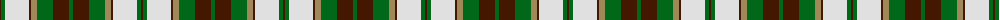

The parent of this is [National Trust](/tartans/dr/2/g4/ln24/dr2/lt6/g16/dr16/g/4/)

This was sourced from register-of-tartans.  It is a [8 stripes tartan](/stripes/stripes8/).

Original link https://www.tartanregister.gov.uk/tartanDetails.aspx?ref=3101

## Thread count
DR/2 G4 LN24 DR2 LT6 G16 DR16 G/4

## Palette
Each colour and its ΔE from the base-6 reference it is a variant of.

| Colour | Shade | Base | ΔE (OKLab) |
|---|---|---|---|
| DR |  `#441800` | B  | 0.22 |
| G |  `#006818` | G  | 0.02 |
| LN |  `#E0E0E0` | W  | 0.06 |
| LT |  `#A08858` | Y  | 0.21 |

# Sample pattern

ID: /variants/dr/2/g4/ln24/dr2/lt6/g16/dr16/g/4-dr441800-g006818-lne0e0e0-lta08858/
