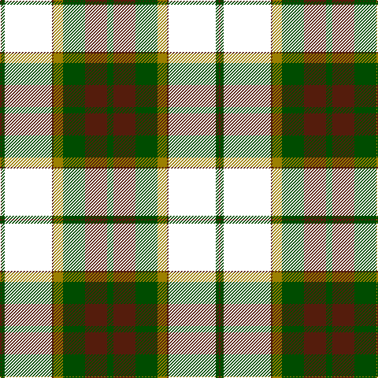

The parent of this is [British Columbia #2](/tartans/dr/2/g4/w60/dr2/lg12/g28/dr28/g/8/)

This was sourced from register-of-tartans.  It is a [8 stripes tartan](/stripes/stripes8/).

Original link https://www.tartanregister.gov.uk/tartanDetails.aspx?ref=5077

## Thread count
DR/2 G4 W60 DR2 LG12 G28 DR28 G/8

## Palette
Each colour and its ΔE from the base-6 reference it is a variant of.

| Colour | Shade | Base | ΔE (OKLab) |
|---|---|---|---|
| DR |  `#541C0C` | B  | 0.20 |
| G |  `#004C00` | G  | 0.08 |
| LG |  `#9C8000` | G  | 0.21 |
| W |  `#FFFFFF` | W  | 0.03 |

# Sample pattern

ID: /variants/dr/2/g4/w60/dr2/lg12/g28/dr28/g/8-dr541c0c-g004c00-lg9c8000-wffffff/
